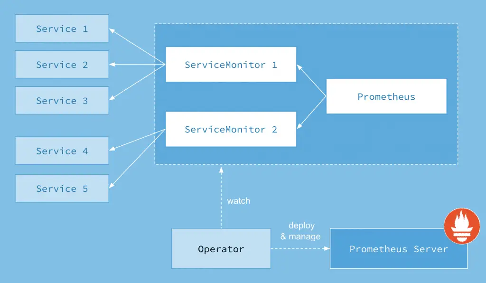

<h1 align="center">Prometheus Operator</h1>

### Overview:

The Prometheus Operator for Kubernetes provides easy monitoring definitions for Kubernetes services and deployment and management of Prometheus instances.

### Operator's features are as follows:

- Create/Destroy: Easily launch a Prometheus instance for your Kubernetes namespace, a specific application or team easily using the Operator.

- Simple Configuration: Configure the fundamentals of Prometheus like versions, persistence, retention policies, and replicas from a native Kubernetes resource.

- Target Services via Labels: Automatically generate monitoring target configurations based on familiar Kubernetes label queries; no need to learn a Prometheus specific  configuration language.
  
- High availability.

- Multiple instances are run across failure zones and data is replicated. This keeps your monitoring available during an outage, when you need it most.

- Updates via automated operations.

- New Prometheus versions are deployed using a rolling update with no downtime, making it easy to stay up to date.

- Handles the dynamic nature of containers.

- Alerting rules are attached to groups of containers instead of individual instances, which is ideal for the highly dynamic nature of container deployment.

### Prometheus Operator Architecture

A high level Prometheus Operator Architecture is shown below :

From the architectural diagram,the ServiceMonitor resource specifies how metrics can be retrieved from a set of services exposing them in a common way.A Prometheus resource object can dynamically include ServiceMonitor objects by their labels. The Operator configures the Prometheus instance to monitor all services covered by included ServiceMonitors and keeps this configuration synchronized with any changes happening in the cluster.

### Objective of tutorial

In this tutorial,we are going to cover following topics:

1. Install Prometheus Operator and verify its successful installation.
2. Create Prometheus Instance and verify status of pods and services.
3. Monitoring a DB or any server using Prometheus and check metrics on Prometheus dashboard.
4. Cleanup Operator.

